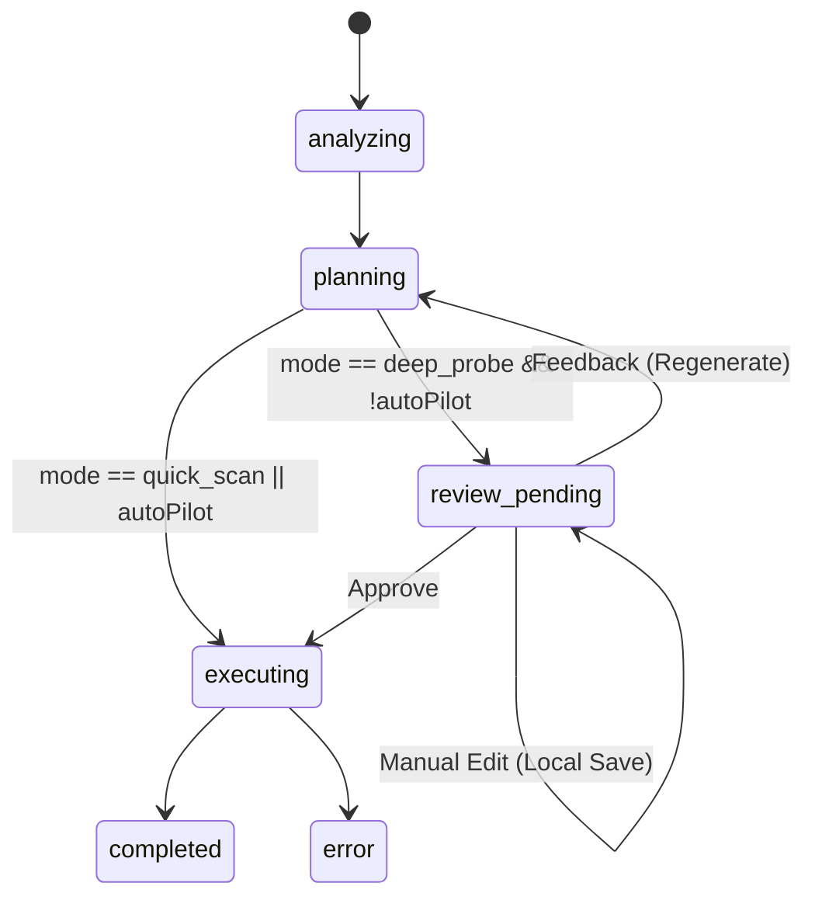

# Data Model: Plan Confirmation

## Entities

### ResearchSession (Extended)
| Field | Type | Description |
|-------|------|-------------|
| autoPilot | boolean | If true, skips `review_pending` state. |
| feedbackHistory | UserFeedback[] | History of feedback provided for this session. |

### ResearchPlan (Existing)
| Field | Type | Description |
|-------|------|-------------|
| sessionId | string | Reference to parent session. |
| rationale | string | Agent's explanation for the plan. |
| steps | PlanStep[] | List of tasks. |

### PlanStep (Existing)
| Field | Type | Description |
|-------|------|-------------|
| id | string | Unique ID within plan. |
| type | 'search' \| 'analyze' | Task type. |
| description | string | Detailed instruction. |
| status | PlanStepStatus | `queued`, `searching`, etc. |
| searchQueries | string[] | (Optional) queries for search tasks. |

### UserFeedback
| Field | Type | Description |
|-------|------|-------------|
| timestamp | string | ISO date. |
| content | string | User's text feedback. |

## State Transitions

## Validation Rules
1. **Empty Plan**: `executing` state MUST NOT be entered if `plan.steps` is empty.
2. **Auto-Pilot**: Defaults to `false` for new sessions.
3. **Status Locking**: Cannot modify plan once in `executing` or `completed` status.
